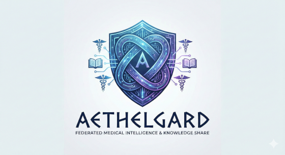
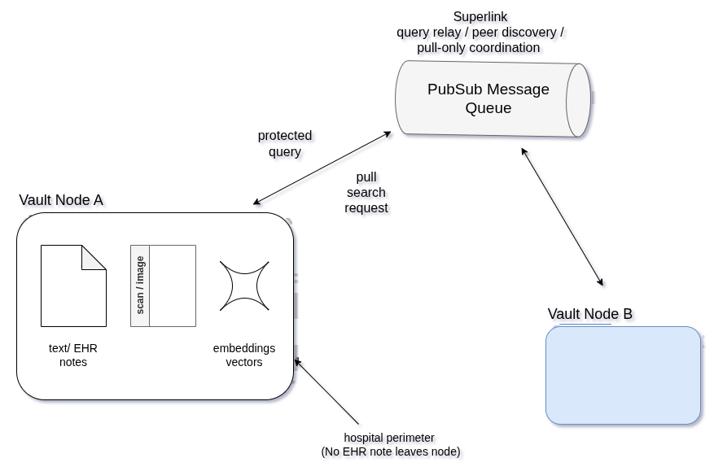
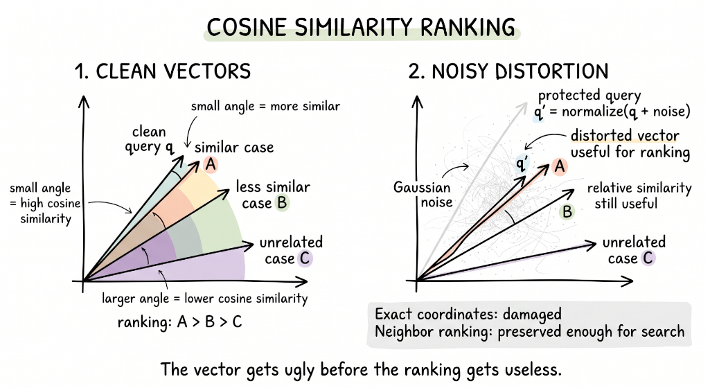

# 🛡️ Aethelgard 2.0

<p align="left">
  
  
  
  
</p>

**Semantic Search Engine for Multimodal Medical Documents.**
<p align="center">

</p>

### About

**Aethelgard** is a lightweight, pure-pull Federated Retrieval-Augmented Generation (FedRAG) framework. 

It was created to query highly sensitive, distributed vector databases (like clinical patient data) without actually moving 
raw data or opening inbound corporate firewalls.
If deployed, Aethelgard could eliminate millions of years of diagnostic waiting time without requiring a single Data Use Agreement (DUA), 
creating a scalable infrastructure for global clinical knowledge exchange

The core idea of Aethelgard is the concept of _Smart Folder_, with allows to turn the directory with collections of medical notes, files, 
and images into a semantic vault. It detects semantic changes, extracts structured clinical evidence, applies protection policy, creates multimodal
representations, records provenance, and commits the result as a semantic revision. Ir resembles the git, but focuses on automatically generating 
the safe semantic representation of undelaying data, which can be shared with peers.

Each Smart Folder, when coupled with network interface, becomes a node in a distributed network, that allow to share knowledge.

### 🌌 The Vision

Solving the rare disease "Diagnostic Odyssey" requires more than a single application; it requires a paradigm shift in how 
clinical systems communicate. Healthcare is notoriously fragmented. Every hospital has a unique IT infrastructure, 
differing firewall policies, and strict, incompatible data governance laws (HIPAA, GDPR, etc.).

What we propose is the architecture of distributed peer-2-peer network that could allow clinicians to organize a virtual 
consensus regarding difficult diagnosis, querying thousands of similar cases spread across 100s of institutions, harnessing the 
whole knowledge in the world, and enormously increasing/empowering the diagnostic power of isolated doctor.


**We did not build an app. We built a protocol.**

Aethelgard is designed as a foundational **Federated Retrieval-Augmented Generation (FedRAG) Framework**. 

We engineered Aethelgard to act as the decentralized nervous system for clinical intelligence:
* **Agnostic to the UI:** Whether a hospital uses Epic, Cerner, or a custom legacy Electronic Health Record (EHR) system, 
  Aethelgard operates at the infrastructure layer, allowing local apps to hook into the global network seamlessly.
* **Adaptable to any IT Environment:** Built on strict Hexagonal Architecture, the core geometric and AI logic is completely 
  decoupled from the transport layer. Each layer can be  
* **Beyond Diagnostics:** While our primary demonstration focuses on rare disease diagnostics, the Aethelgard protocol can be 
  instantly adapted for pharmacovigilance (detecting rare adverse drug reactions globally), multi-center clinical trial matching, 
  and real-time epidemiological tracking, or used as an oracle in distributed training of models, effectively playing the role of  
  human expert in RLHF approach - all without moving a single row of raw data.


### 🏗️ Architecture 

The core concept of Smart Folder
The lowest level and the central idea is the concept of Smart Folder. 

<p align="center">


<em>Figure 2: Smart Folder handles the lowest level of processing, and is the closest level to the documents.</em>
</p>

Smart Folder has a pluggable design. The current stack uses **Qwen3-4B-Instruct-2507** for evidence extraction, 
**EmbeddingGemma-300m** for clinical text, and **MedSigLIP-448** for medical images. 
Each component sits behind a replaceable interface. 
We were inspired by object-based of version control like `git`, and implemented something very similar.


```text
medical documents
  → semantic evidence
  → deterministic privacy boundary
  → multimodal representations
  → reproducible revision
  → local search / protected-query experiments
```


<p align="center">


<em>Figure 3: System Design of our protocol. Super-link is built on the basis of message queue. 
  For each component we have a pre-defined interface in our framework</em>
</p>

### 🏗️ How It Works (The Pure-Pull Workflow)

1. **Broadcast:** The global orchestrator drops a vectorized query into a secure mailbox (Broker).
2. **Pull:** The client node (behind a strict hospital firewall) wakes up on its 10-second heartbeat and asks, *"Do I have any mail?"*
3. **Local RAG:** Each Node gets the query and searches the closest vector locally.
4. **Upload:** The client pushes the safe insight back to the orchestrator (super-link on the diagram).


### 🧮 Security Innovation: Empirical Noise vs. LDP

The most significant technical hurdle in Federated RAG is ensuring that transmitted semantic vectors cannot be reverse-engineered 
to reveal patient Protected Health Information (PHI). 

Our empirical evaluation of 1920-dimensional clinical vectors revealed that strict Local Differential Privacy (LDP) is 
mathematically incompatible with exact Top-1 retrieval utility in high-dimensional spaces. 
Applying standard LDP collapsed Top-1 retrieval accuracy to under 10%. 

To resolve this, Aethelgard utilizes an **Empirical Noise Strategy**. 
By applying a controlled Gaussian noise ($\sigma=0.2$) directly to the vectors, we degrade the raw vector similarity to 0.116 
(rendering exact inversion mathematically impossible) while perfectly preserving the relative spatial geometry. 

> Aethelgard exploits an asymmetry between reconstruction and retrieval. 
> Reconstruction benefits from the exact embedding; retrieval only needs enough relative similarity to identify nearby cases. 
> By perturbing the vector, we can substantially damage its absolute representation while retaining enough of the original similarity signal 
> for useful nearest-neighbor ranking.


### 🧮 Research

the goal of the research was to prove our core idea:

> Distort the representation, preserve the signal

Aethelgard does not need a protected vector to resemble the original vector. It only needs clinically similar cases to remain more similar 
than unrelated cases.

1. The first research question was to investigate in details the reverse vector attack and to determine the cure.

<p align="center">


<em>Figure 4: How much noise is too much, how to choose the sweet spot?</em>
</p>

👉 **[Privacy-Utility Trade-off Analysis](docs/LDP_and_Empirical_Noise_Parameter_Selection_Analysis.ipynb)** 
👉 **[Paper Draft](https://github.com/akaliutau/aethelgard2/raw/main/docs/Privacy_Utility_Tradeoff_Analysis.pdf)** 

2. The second question is to validate the reliability and usefulness of search engine with heavy data obfuscation and vector noise.

We created a vault consisting of 31 records and initialize a SmartFloder with all embeddings and pre-processing.

We found the useful operating region: the vector can be heavily perturbed before retrieval ranking collapses. 
In the current 31-case PoC, protected queries preserved the clean Top-1 result in 93.8% of queries.


| Metric                              | Value  |
|-------------------------------------|--------|
| cases                               | 31/31  |
| processing success                  | 100.0% |
| median pipeline latency /inference/ | 106.9s |
| p95 pipeline  latency /inference/   | 171.3s |
| known-field accuracy                | 66.4%  |
| safe cases no canary                | 100.0% |
| mean Recall@5                       | 65.4%  |
| mean MRR                            | 0.499  |
| protected top-1 keep                | 93.8%  |
| protected top-k ovlp                | 93.8%  |
| vault verify                        | OK     |

More details and about how to reproduce results are in [research](docs/RESEARCH.md) section.

## 📂 Project Structure

```text
aethelgard/
├── aethelgard/                 # Core package + CLI + pipeline + adapters
├── demo/                       # One-record toy vault
├── deploy/cloudrun/            # Cloud Run worker image
├── scripts/                    # Deploy / cache / warm-up helpers
├── utils/                      # Dataset + research runners
├── notebooks/                  # Privacy/utility experiments
├── docs/                       # Short technical docs
├── tests/
└── pyproject.toml
```

---

## 🚀 Setup

```bash
git clone https://github.com/akaliutau/aethelgard2.git
cd aethelgard2

conda create -n a2 python=3.12 -y
conda activate a2

pip install -e ".[all]"
aethelgard --help
```

For a **local model run**, HuggingFace token must be set. 
NOTE: this project is using gated models, so you have to accept access to the configured Google checkpoints and set:

```bash
export HF_TOKEN="hf_..."
```

If already deployed remote worker is used, then this does not need a local Hugging Face token.

---

## 🧪 Run the One-Record Demo

Create a clean copy:

```bash
cd demo

aethelgard init
aethelgard status
```

Expected:

```text
1 case requires processing
```

### Local (can run on any machine, both CPU/GPU, but the latter helps much faster processing)

```bash
aethelgard run
```

The first run loads Qwen, EmbeddingGemma, and MedSigLIP locally, so that cold run can take time (5-7 min).
Subsequent runs usually require 1-2 min to finish.

### Remote GPU

```bash
export WORKER_URL="https://aethelgard-vault-worker-ud4oy3q2sq-uc.a.run.app"
aethelgard run --remote "$WORKER_URL"
```

Expected shape:

```text
Processing 1 case(s) ...
✓ CASE-00002  extractor=...  redactions=...  109496 ms
revision 585a98639d2e
```

Then:

```bash
aethelgard status
```

Expected:

```text
0 case(s) require processing; 1 clean.
```

---

## 🔎 Inspect What Aethelgard Built

```bash
aethelgard show CASE-00002
aethelgard show CASE-00002 --view provenance
aethelgard verify
aethelgard log
```

Derived artifacts are stored under:

```text
.aethelgard/derived/CASE-00002/<semantic-fingerprint>/
```

You should see evidence, privacy/provenance data, embeddings, fact vectors, and the manifest.

---

## 🔍 Search

Text:

```bash
aethelgard search "pneumonia with hypoxemia"
```

Text + image:

```bash
aethelgard search \
  "similar radiographic case" \
  --image CASE-00002/chest.jpg
```

Clean vs protected:

```bash
aethelgard search \
  "similar radiographic case" \
  --image CASE-00002/chest.jpg \
  --compare-protection \
  --seed 42
```

Search uses committed vectors; it does **not** rerun Qwen.

---

## 🧮 Reproduce the Research Run

Generate the corpus:

```bash
python utils/prepare_research_dataset.py \
  dataset/Hospital_A \
  --images-root dataset/Hospital_A \
  --force
```

This creates:

```text
aethelgard-research/
├── vaults/mixed/
└── research/ground_truth.jsonl
```

Initialize and run:

```bash
cd aethelgard-research/vaults/mixed
aethelgard init

python /path/to/aethelgard/utils/run_research.py \
  --vault . \
  --remote "$WORKER_URL" \
  --ground-truth ../../research/ground_truth.jsonl
```

Notebook-ready outputs:

```text
.research/latest/
├── summary.json
├── cases.csv
├── search.csv
├── protection.csv
└── *.jsonl
```

See **[docs/RESEARCH.md](docs/RESEARCH.md)** for the results and the notebook audit.

---

## ☁️ Cloud Worker

The worker runs the same semantic pipeline on an L4 GPU while the Smart Folder remains local.

```text
local case → Cloud Run GPU → derived artifacts → local commit
```

For the demo:

```bash
ENV_FILE=.env.cloud scripts/warm_service.sh --keep
```

Deployment details:

👉 **[docs/CLOUD_RUN.md](docs/CLOUD_RUN.md)**

---

## 🧰 CLI Handbook

```text
init      create a Smart Folder
status    show dirty / clean cases
run       process locally or remotely
show      inspect evidence / metadata
diff      compare semantic revisions
log       show revision history
verify    verify stored artifacts
search    search committed vectors
protect   create a protected query envelope
```

---

## 📚 Reference

* **[Architecture](docs/ARCHITECTURE.md)**
* **[Cloud Run](docs/CLOUD_RUN.md)**
* **[Research](docs/RESEARCH.md)**
* **[Research Dataset](docs/RESEARCH_DATASET.md)**

---

## ⚖️ License

Aethelgard is open-source software distributed under the **MIT License**.

